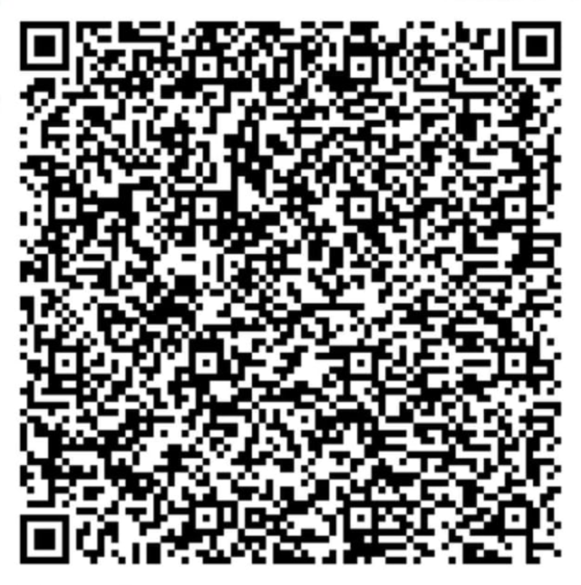

## Hello i'm Mas Tomi 👋

#### Contact with me:

#### Support with me:

  

    
  

   

  

    <h3>💖 Support Me</h3>
    
Dukung saya agar tetap aktif dan terus berkarya. Terima kasih!

     
    
    <h4>DANA</h4>
    
Scan QRIS menggunakan aplikasi DANA atau E-Wallet / Mobile Banking lainnya

     
    
  

#### Languages and Tools:

